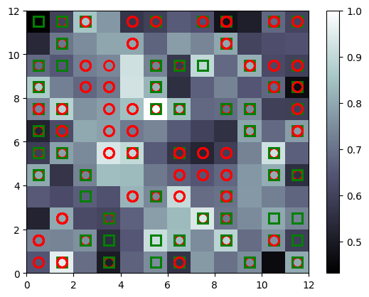
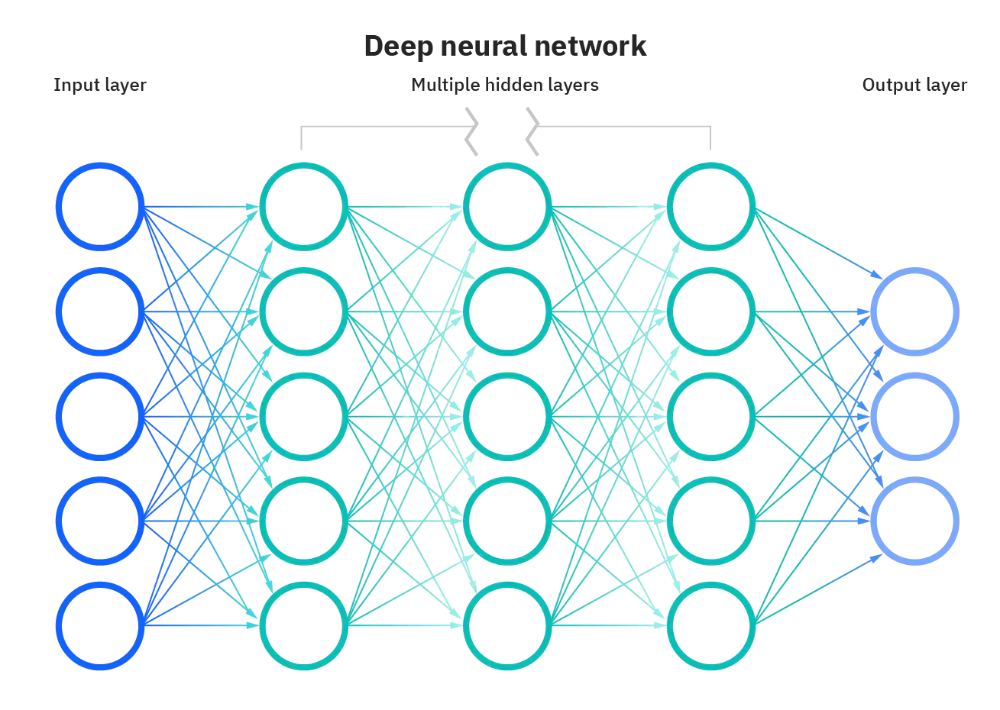

# Fraud Detection

## Self Organizing Maps

(SOMs) can be a useful tool for fraud detection due to their ability to discover and represent complex patterns within data. SOMs are a type of unsupervised machine learning algorithm that can perform clustering and visualization tasks. Below is the example of a SOM that was trained on a credit card applications dataset. The SOM was able to detect the customers that were more likely to commit fraud. 

The **squares** represent the customers that were approved for their credit card applications while the **circles** represent the customers that were not approved. 

The darker the color on a neuron the more customers it has clustered. **The white neurons are the outliers. Meaning that the customers that are represented by the white neurons are the customers that are more likely to commit fraud**, because they are not clustered with the majority of the customers that were approved. 

**The unapproved customers and white neurons are most likely disaproved by mistake or could not be categorized by staff therefore rejected.**

## Training the Neural Network to predict the probability of customer fraud

Going from unsupervised to supervised deep learning. By labeling the customers by potential fraunch behavior we get an idea of what a fraud customer looks like. We can then train a supervised deep learning model to predict the probability of a customer being a fraud. We will use all the features of the customer to predict the probability of fraud except the customer ID. Even the "Class" (approved or not) feature will be used as a dependent variable.

## Dataset information

Statlog (Australian Credit Approval)

Additional Information

This file concerns credit card applications.  All attribute names and values have been changed to meaningless symbols to protect confidentiality of the data.
  
This dataset is interesting because there is a good mix of attributes -- continuous, nominal with small numbers of values, and nominal with larger numbers of values.  There are also a few missing values.

Additional Information

There are 6 numerical and 8 categorical attributes.  The labels have been changed for the convenience of the statistical algorithms.  For example, attribute 4 originally had 3 labels p,g,gg and these have been changed to labels 1,2,3.
                             
- A1: 0,1    CATEGORICAL (formerly: a,b)
- A2: continuous.
- A3: continuous.
- A4: 1,2,3    CATEGORICAL  (formerly: p,g,gg)
 -A5: 1, 2,3,4,5, 6,7,8,9,10,11,12,13,14    CATEGORICAL (formerly: ff,d,i,k,j,aa,m,c,w, e, q, r,cc, x)
- A6: 1, 2,3, 4,5,6,7,8,9    CATEGORICAL (formerly: ff,dd,j,bb,v,n,o,h,z)
- A7: continuous.
- A8: 1, 0    CATEGORICAL (formerly: t, f)
- A9: 1, 0	CATEGORICAL (formerly: t, f)
- A10:  continuous.
- A11:  1, 0	    CATEGORICAL (formerly t, f)
- A12:  1, 2, 3    CATEGORICAL (formerly: s, g, p) 
- A13:  continuous.
- A14:  continuous.
- A15:   1,2  class attribute (formerly: +,-) 